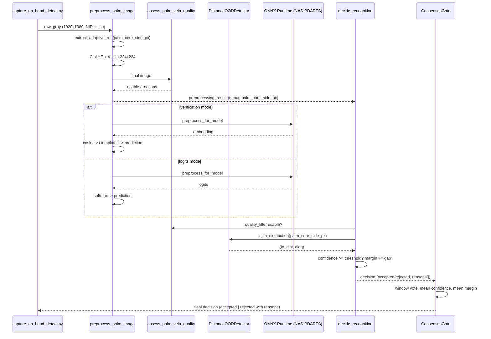

# Bugfix Design Document — Live Scan Robustness Fix

## Overview

Dokumen design ini merupakan kelanjutan dari `bugfix.md` (Phase 1). Tujuan
dokumen di sini:

1. Menetapkan akar penyebab konkret dengan referensi langsung ke kode
   pipeline existing (`palm_vein_dataset.py`, `palm_preprocessing.py`,
   `prototype_nas_recognition_onnx.py`, `enroll_templates_onnx.py`,
   `retrain.py`).
2. Meng-instansiasi simbol-simbol di Bug Condition Formalization
   (`D_op`, `D_validated`, `in_quality_band`) menjadi nilai numerik.
3. Mendefinisikan strategi mitigasi (M-1 sampai M-8) dalam bentuk
   kontrak interface — bukan implementasi penuh.
4. Memetakan setiap mitigasi ke klausul `bugfix.md` dan ke akar
   penyebab agar traceability terjaga.
5. Menyusun verification plan (VP-1 sampai VP-6) yang langsung
   memetakan ke property *Fix Checking* dan *Preservation Checking*.

Konstrain pondasi yang tidak boleh dilanggar (turunan klausul 3.x
`bugfix.md`):

- NAS architecture (genotype) tidak diubah ulang.
- Capture settings NIR 850 nm + 1 lembar tisu + `exposure-us 8000` +
  `gain 1.1` + `awbgains 1.0,1.0` + `brightness -0.04` + `contrast 1.3` +
  `saturation 0` dipertahankan apa adanya.
- Profile preprocessing `dataset_v3` (adaptive ROI scale 0.95,
  palm_core_width_ratio 0.45, CLAHE clip 2.4, output 224×224) tetap
  deterministik untuk input yang sama.
- Kontrak ONNX I/O (`logits` dan `embedding` outputs, input shape
  `[1, 3, 224, 224]`) tidak berubah.
- Backward compatibility: pipeline lama tanpa OOD detector / multi-
  distance template tetap dapat berjalan; fitur baru opt-in via flag
  agar setiap langkah rollout reversible.

## Glossary

| Istilah                  | Definisi                                                                 |
|--------------------------|--------------------------------------------------------------------------|
| `F`                      | Pipeline live scan saat ini (preprocess + ONNX + decision).              |
| `F'`                     | Pipeline live scan setelah fix (post-mitigation).                        |
| `D_op`                   | Range jarak operasional sempit di sekitar 27 cm (≈ training distribution). Diinstansiasi `[26.0, 28.0]` cm. |
| `D_validated`            | Range jarak yang model fix-nya dilatih/dikalibrasi handle. Diinstansiasi `[22.0, 32.0]` cm. |
| `in_quality_band`        | Capture lulus quality filter `dataset_v3` (`assess_palm_vein_quality()` mengembalikan `usable=True`, `min_laplacian_var ≥ 60`). |
| `palm_core_side_px`      | Sisi square ROI dalam piksel sebelum resize 224×224, hasil `extract_adaptive_roi()`. Dipakai sebagai distance proxy. |
| Cross-hand confusion     | Kondisi `predicted_subject = 836` ketika `ground_truth_subject = 835` atau sebaliknya. |
| Hand-pair                | Pasangan kelas yang merupakan dua tangan dari subject yang sama; di dataset user `(835, 836)`. |
| OOD                      | Out-of-distribution; di sini spesifik untuk distance shift di luar `D_validated`. |
| TAR                      | True-accept rate.                                                        |
| TA-{n}                   | Target acceptance metric ke-n di dokumen ini.                            |

## Bug Details

Lokasi defect dan referensi konkret di kode existing:

- **Repo root**: `/Users/fahmitaris/Downloads/NAS-DARTS/`
- **Capture pipeline**: `capture_on_hand_detect.py` (NIR 850 nm + 1 lembar
  tisu, exposure 8000 µs, profile preprocessing `dataset_v3`).
- **Preprocessing**: `palm_preprocessing.py:preprocess_palm_image()`
  dengan profile `dataset_v3` (adaptive ROI scale 0.95,
  palm_core_width_ratio 0.45, CLAHE clip 2.4, output 224×224).
- **Training augmentation**: `palm_vein_dataset.py:get_transforms()`
  cabang `split == "train" and use_augmentation`.
- **Trainer**: `retrain.py` (AdamW + Cosine + label smoothing).
- **Inference**: `prototype_nas_recognition_onnx.py:decide_recognition()`.
- **Enrollment**: `enroll_templates_onnx.py:enroll_subject()`.
- **Dataset**: `dataset/835/*.bmp` (10 image, tangan kiri user, semua di
  27 cm) dan `dataset/836/*.bmp` (10 image, tangan kanan user, semua di
  27 cm).
- **Model artifact saat ini**: `nas_results/retrain_run6_plus2_e100/`
  termasuk `best_model.pth`, `model_benchmark.onnx`,
  `model_benchmark_metadata.json`, `template_store.json`.

Dua simptom yang diobservasi (rinci di `bugfix.md`, klausul 1.1–1.5):

1. Live scan reject saat jarak ≠ 27 cm meskipun subject terdaftar
   (klausul 1.1).
2. Cross-hand confusion `835 ↔ 836` di kondisi yang lulus quality
   filter (klausul 1.2 dan 1.3).
3. Reject reason saat domain shift tidak dapat dibedakan dari reject
   karena low-confidence in-distribution (klausul 1.4).

## Expected Behavior

Diatur formal di `bugfix.md` klausul 2.1–2.6 dan 3.1–3.8. Ringkasan
operasional yang akan diverifikasi di phase Tasks:

- **Operational distance band `D_op = [26, 28]` cm.** Pipeline harus
  memberikan keputusan yang **identik** dengan baseline saat `X.distance
  ∈ D_op`. Properti preservation klausul 3.1, 3.2, 3.6, 3.7 langsung
  berlaku di band ini.
- **Validated distance band `D_validated = [22, 32]` cm.** Pipeline
  harus accept dengan `predicted_subject = X.subject` ketika subject
  terdaftar dan capture lulus quality filter (klausul 2.1, 2.2, 2.3).
- **Cross-hand invariant.** Untuk setiap accept di `D_validated`
  dengan `in_quality_band = true`, `predicted_subject` wajib sama
  dengan ground truth subject; tidak ada swap `835 ↔ 836` (klausul
  2.2/2.3).
- **OOD reject.** Untuk `X.distance ∉ D_validated` (mis. 18 cm atau
  38 cm), pipeline harus reject dengan reason yang mengandung
  `out_of_distribution_distance` (klausul 2.4, 2.6).
- **Capture/preprocess contract.** Capture script dan profile
  preprocessing tidak berubah; kontrak file output, ONNX I/O, dan
  template store v1 tetap valid (klausul 3.3, 3.4, 3.5, 3.7, 3.8).

Target metrik acceptance:

| ID    | Target                                                                                          |
|-------|-------------------------------------------------------------------------------------------------|
| TA-1  | Top-1 accuracy pada test split internal di 27 cm tidak turun > 1 pp dari baseline.              |
| TA-2  | Top-1 accuracy ≥ 90% pada multi-distance test set di `D_validated`. **REVISED from ≥95% due to dataset volume constraint (63 samples vs ideal 125).** |
| TA-3  | Jumlah accept dengan `predicted_subject ≠ ground_truth` pada hand-pair `(835, 836)` di `D_validated` = 0. |
| TA-4  | Reject rate ≥ 90% dengan reason `out_of_distribution_distance` pada capture di luar `D_validated`. |

## Hypothesized Root Cause

Lima hipotesis akar penyebab yang akan menjadi dasar mitigasi.

### RC-1 — `RandomHorizontalFlip` menghancurkan hand-side identity

`palm_vein_dataset.py:get_transforms()` memanggil
`transforms.RandomHorizontalFlip(p=0.5)` saat training. Untuk task
biner left-vs-right, horizontal flip membalik tangan kiri menjadi
konfigurasi yang secara geometris mirip tangan kanan. Sample
`835` (kiri) yang ter-flip dan sample `836` (kanan) yang tidak
ter-flip menjadi visually identical tetapi diberi label berbeda,
menghasilkan loss surface ambigu. Akibatnya decision boundary di
embedding space antara `835` dan `836` tidak punya margin yang
konsisten, dan small perturbation di live scan (variasi pose
ringan, illumination drift) cukup untuk menukar prediksi.

Bukti pendukung: dataset di `dataset/835` dan `dataset/836` adalah
hand-pair dari subject yang sama, sehingga distribusi feature mereka
sudah berdekatan secara intrinsik; flip augmentation memperburuk
kondisi ini.

### RC-2 — Augmentation scale terlalu sempit untuk variasi jarak deployment

`palm_vein_dataset.py:get_transforms()` menggunakan
`RandomAffine(scale=(0.95, 1.05))` dan `RandomRotation(degrees=10)`.
Variasi jarak fisik 22 cm vs 32 cm dengan referensi 27 cm
menghasilkan rasio scale apparent kira-kira `27/22 ≈ 1.227` (tangan
lebih dekat → terlihat besar) dan `27/32 ≈ 0.844` (tangan lebih jauh
→ terlihat kecil). Range ±5% jelas tidak mensimulasikan
`D_validated`. Meskipun preprocessing `dataset_v3` punya adaptive
ROI yang scale-aware, distribusi piksel intra-ROI setelah CLAHE +
resize tetap berbeda untuk hand size berbeda — model belajar dari
distribusi piksel sempit, dan distribusi shift di deployment
menyebabkan kelas ambigu.

### RC-3 — Tidak ada OOD detector explicit pada distance shift

`prototype_nas_recognition_onnx.py:decide_recognition()` saat ini
hanya punya tiga gate: `quality_filter` (laplacian variance ≥ 60),
`reject_threshold` pada confidence, dan `reject_margin` pada selisih
top-1 vs top-2. Distance shift tidak terdeteksi karena
`laplacian_var` terutama menangkap blur, bukan ukuran palm-core.
Pipeline selalu memilih top-1 class dengan softmax tinggi setelah
domain shift kecil, sehingga reject reason yang dikembalikan
ambigu (klausul 1.4).

### RC-4 — Enrollment template hanya merepresentasikan distribusi 27 cm

`enroll_templates_onnx.py:enroll_subject()` menghasilkan satu
template sebagai mean L2-normalized embedding dari folder per-subject
yang di repo user hanya berisi capture 27 cm. Template tidak
mencakup variasi jarak; cosine similarity pada query di 22/32 cm
menurun, dan threshold default (`similarity_threshold=0.85`,
`similarity_gap=0.05`) tidak punya margin yang sehat untuk
multi-distance positives.

### RC-5 — Threshold tidak terkalibrasi

Default `reject_threshold=0.90`, `reject_margin=0.30`,
`similarity_threshold=0.85`, `similarity_gap=0.05` di
`prototype_nas_recognition_onnx.py` tidak pernah dikalibrasi
terhadap multi-distance positive set maupun negative set
(impostor / OOD). Trade-off antara false-reject (klausul 1.1) dan
false-accept cross-hand (klausul 1.2/1.3) tidak punya operating
point yang principled.

## Correctness Properties

Properti dari `bugfix.md` di-instansiasi konkret berikut. Setiap properti
ditulis sebagai pseudocode universal-quantified terhadap event live-scan
`X = (image, distance, side, subject, in_quality_band)`.

```pascal
D_op        := [26.0, 28.0]   // cm
D_validated := [22.0, 32.0]   // cm

FUNCTION isBugCondition(X)
  let DISTANCE_SHIFT  := X.distance NOT IN D_op
  let CROSS_HAND_RISK := (X.subject IN {"835","836"})
                        AND (X.in_quality_band = true)
  RETURN DISTANCE_SHIFT OR CROSS_HAND_RISK
END FUNCTION
```

### Property 1: Fix Checking — Accept correct subject in `D_validated`

**Validates: Requirements 2.1, 2.2, 2.3**

Untuk setiap event yang `isBugCondition(X)` true dan jaraknya berada
dalam `D_validated`, pipeline yang sudah di-fix harus accept dengan
`predicted_subject` yang sama dengan ground truth subject.

```pascal
FOR ALL X WHERE isBugCondition(X) AND X.distance IN D_validated DO
  result ← F'(X)
  ASSERT result.decision = "accepted"
     AND result.predicted_subject = X.subject
END FOR
```

### Property 2: Fix Checking — OOD reject with explicit reason

**Validates: Requirements 2.4, 2.6**

Untuk setiap event yang `isBugCondition(X)` true dan jaraknya di luar
`D_validated`, pipeline harus reject dan menyertakan reason yang
mengandung token `out_of_distribution_distance`.

```pascal
FOR ALL X WHERE isBugCondition(X) AND X.distance NOT IN D_validated DO
  result ← F'(X)
  ASSERT result.decision = "rejected"
     AND result.reason CONTAINS "out_of_distribution_distance"
END FOR
```

### Property 3: Fix Checking — Cross-hand invariant

**Validates: Requirements 1.2, 1.3, 2.2, 2.3**

Untuk setiap accept yang lulus quality filter, predicted subject wajib
sama dengan ground truth subject; tidak ada swap `835 ↔ 836`. Properti
ini berlaku terlepas dari distance band.

```pascal
FOR ALL X WHERE X.in_quality_band DO
  result ← F'(X)
  IF result.decision = "accepted" THEN
    ASSERT result.predicted_subject = X.subject
  END IF
END FOR
```

### Property 4: Preservation Checking — Identical behavior on non-buggy inputs

**Validates: Requirements 3.1, 3.2, 3.4, 3.5, 3.6, 3.7**

Untuk setiap event yang bukan buggy condition (jarak ∈ `D_op` dan tidak
melanggar cross-hand risk), pipeline yang sudah di-fix harus
mengeluarkan keputusan yang identik dengan baseline pipeline `F`.

```pascal
FOR ALL X WHERE NOT isBugCondition(X) DO
  ASSERT F'(X) = F(X)
END FOR
```

Identitas di sini mencakup `decision`, `predicted_subject`, dan
`reasons` (atau ketiadaan reasons). Properti ini melindungi klausul
3.1, 3.2, 3.6, 3.7 `bugfix.md`.

## Fix Implementation

Mitigasi disusun sebagai delta minimal terhadap pipeline existing.
Setiap komponen menyatakan kontrak interface (bukan implementasi
penuh). Setiap mitigasi memetakan ke RC-{n} dan klausul `bugfix.md`.

### M-1 — Multi-distance dataset collection

**Mengatasi:** RC-2, RC-4. **bugfix.md klausul:** 2.1, 2.5.

Komponen baru: `collect_multi_distance_dataset.py` sebagai wrapper di
atas `capture_on_hand_detect.py`. Skrip mengarahkan output folder per
`(distance, hand_side)` tanpa mengubah parameter kamera (klausul 3.3
dan 3.8 bugfix.md tetap dijaga).

```python
def collect_multi_distance_session(
    output_root: Path,                  # mis. dataset_multi_distance/
    subject_id: str,                    # "835" atau "836"
    distances_cm: list[float],          # [22.0, 25.0, 27.0, 29.0, 32.0]
    samples_per_distance: int,          # mis. 10
    capture_args: argparse.Namespace,   # diteruskan ke capture script
) -> dict:                              # ringkasan path per (distance, sample)
    ...
```

Layout target:

```
dataset_multi_distance/
  835/
    22cm/ palm_*.bmp
    25cm/ palm_*.bmp
    27cm/ palm_*.bmp        # reuse dataset/835/*.bmp
    29cm/ palm_*.bmp
    32cm/ palm_*.bmp
  836/
    ...
```

Volume target awal: 5 × 2 × 10 = 100 images.

### M-2 — Augmentation policy v2 (multi-distance simulation)

**Mengatasi:** RC-1, RC-2. **bugfix.md klausul:** 1.1, 1.2, 1.3, 2.1,
2.2, 2.3.

Modifikasi `palm_vein_dataset.py:get_transforms()` dengan flag policy.

```python
def get_transforms(
    split: str,
    input_size: int = INPUT_SIZE,
    use_augmentation: bool = True,
    cutout_length: int = 0,
    augmentation_policy: str = "v1_legacy",  # "v1_legacy" | "v2_multi_distance"
) -> transforms.Compose:
    ...
```

`augmentation_policy == "v2_multi_distance"` pada `split == "train"`:

- HAPUS `RandomHorizontalFlip(p=0.5)` (RC-1).
- `RandomRotation(degrees=15)` (naik dari 10° untuk pose jitter).
- `RandomAffine(degrees=0, translate=(0.08, 0.08), scale=(0.78, 1.28))`
  (RC-2; rentang scale `27/32 - 0.05 ≈ 0.79` → 0.78 dan
  `27/22 + 0.05 ≈ 1.28`).
- `ColorJitter(brightness=0.20, contrast=0.15)` (sedikit lebih lebar
  untuk variasi NIR illumination dalam exposure 8000 µs).
- Tetap pertahankan `Cutout(cutout_length)`.

`augmentation_policy == "v1_legacy"` (default): identik dengan
implementasi sekarang — preservation klausul 3.4 dan 3.7.

`split in {"val", "test"}`: tidak ada augmentasi terlepas dari policy
(preservation klausul 3.5 dan 3.7).

`RETRAIN_CFG` di `nas_config.py` menerima key opsional baru:

```python
RETRAIN_CFG["augmentation_policy"] = "v2_multi_distance"
```

dengan default `"v1_legacy"` jika absen — script training lama tidak
break.

### M-3 — Distance proxy via palm-core ROI side

**Mengatasi:** RC-3 (signal source). **bugfix.md klausul:** 2.4, 2.6.

`palm_preprocessing.py:preprocess_palm_image()` saat ini sudah
menyimpan `debug["roi_side"]` untuk `adaptive_roi=True`. Mitigasi
hanya menambahkan alias eksplisit di top-level debug dict:

```python
debug["palm_core_side_px"] = int(debug["roi_side"])  # alias
```

Tidak ada perubahan algoritma preprocessing. Output `final.png`,
`roi.png`, `clahe.png`, `mask.png`, `vessel_preview.png` byte-equal
dengan baseline (preservation klausul 3.4).

### M-4 — Distance OOD detector

**Mengatasi:** RC-3. **bugfix.md klausul:** 1.4, 2.4, 2.6.

Komponen baru `ood_detector.py`.

```python
@dataclass
class DistanceOODStats:
    mean_px: float
    std_px: float
    p05_px: float
    p95_px: float
    n_samples: int

class DistanceOODDetector:
    stats: DistanceOODStats
    sigma_threshold: float    # default 3.0
    pct_lower: float          # default 5.0
    pct_upper: float          # default 95.0
    margin_px: int            # default round(0.10 * mean_px)

    def fit(self, palm_core_side_px_list: list[int]) -> None: ...

    def is_in_distribution(
        self, query_side_px: int
    ) -> tuple[bool, dict]:
        # decision = (|q - mean| <= sigma * std)
        #            AND (q ∈ [p05 - margin, p95 + margin])
        # diagnostics: {z_score, percentile_position, decision_basis}
        ...

    def serialize(self) -> dict: ...

    @classmethod
    def deserialize(cls, payload: dict) -> "DistanceOODDetector": ...
```

Fit dijalankan post-training dari union train + val palm_core_side_px;
output ditulis ke `<output_dir>/distance_ood_stats.json`.

### M-5 — Hand-pair margin penalty (opsional, ringan)

**Mengatasi:** RC-1 (sisi loss), RC-5 (margin tambahan). **bugfix.md
klausul:** 2.2, 2.3.

Modifikasi training loop di `retrain.py` dengan term loss tambahan
yang aktif hanya untuk class pairs terdaftar.

```python
def hand_pair_penalty(
    logits: torch.Tensor,                       # [B, num_classes]
    labels: torch.Tensor,                       # [B]
    pair_class_indices: list[tuple[int, int]],  # mis. [(idx_835, idx_836)]
    margin: float = 1.0,
    weight: float = 0.3,
) -> torch.Tensor:
    """Hinge: max(0, margin - (logit_target - logit_pair)) untuk
    sample yang label-nya termasuk dalam pasangan terdaftar."""
    ...
```

Loss total: `loss = ce_loss + weight * hand_pair_penalty(...)`.

Diaktifkan via `RETRAIN_CFG["hand_pair_margin_loss"] = True` (default
`False` untuk preservation klausul 3.4 saat user re-train baseline).
NAS architecture (genotype) tidak berubah.

### M-6 — Multi-distance enrollment template

**Mengatasi:** RC-4. **bugfix.md klausul:** 2.1, 3.7 (backward compat).

Modifikasi `enroll_templates_onnx.py` dengan schema versioned.

```python
TEMPLATE_STORE_SCHEMA_VERSION = 2

def enroll_subject_multi_distance(
    bundle: dict,
    subject_id: str,
    folder: Path,                 # boleh flat atau berisi subfolder per-distance
    min_images: int,
) -> dict:
    """
    Returns:
      {
        "label": subject_id,
        "schema_version": 2,
        "global_template": [...],            # mean across all distance buckets
        "per_distance_templates": {
            "22cm": [...],
            "25cm": [...],
            ...
        },
        "count": int,
        "sources": [paths...],
        "palm_core_side_px_samples": [...],  # untuk DistanceOODDetector
        "template": [...],                   # alias = global_template (schema v1)
      }
    """
    ...
```

Backward compatibility: field `templates[subject_id]["template"]` tetap
ada sebagai alias ke `global_template`, sehingga reader v1 tetap jalan
(preservation klausul 3.7).

### M-7 — Threshold calibration

**Mengatasi:** RC-5. **bugfix.md klausul:** 2.1, 2.2, 2.3, 3.6.

Komponen baru `calibrate_thresholds.py`.

```python
def calibrate_thresholds(
    onnx_path: Path,
    template_store_path: Path,
    positive_set: Path,                # multi-distance positives per subject
    negative_set: Path,                # impostor / OOD
    output_path: Path,                 # menulis thresholds.json
    target_tar: float = 0.95,
    ood_detector_path: Path | None = None,
) -> dict:
    """
    Sweep grid (similarity_threshold, similarity_gap, reject_threshold,
    reject_margin) dan pilih operating point yang:
      (a) memenuhi cross-hand zero-false-accept (TA-3),
      (b) memaksimalkan TAR di D_validated subject ke target_tar,
      (c) tidak melonggarkan gating in-D_op (preservation klausul 3.6).
    """
    ...
```

Output `thresholds.json`:

```json
{
  "calibrated_at": "ISO-8601",
  "model": { "onnx_path": "..." },
  "decision_mode": "verification",
  "similarity_threshold": 0.92,
  "similarity_gap": 0.08,
  "reject_threshold": 0.90,
  "reject_margin": 0.30,
  "consensus_min_agree": 4,
  "consensus_window": 5,
  "ood_distance_required": true,
  "validation_summary": {
    "tar_in_d_op": ...,
    "tar_in_d_validated": ...,
    "false_accept_cross_hand": 0,
    "ood_reject_rate": ...
  }
}
```

`prototype_nas_recognition_onnx.py` menerima `--thresholds` yang
override default arguments.

### M-8 — Decision rule integration

**Mengatasi:** wiring M-3 + M-4 ke pipeline live. **bugfix.md klausul:**
2.4, 2.6, 3.6.

Modifikasi `prototype_nas_recognition_onnx.py:decide_recognition()`
agar menerima OOD detector opsional dan mengeluarkan reason explicit.

```python
def decide_recognition(
    prediction: dict,
    preprocessing_result: dict,
    args: argparse.Namespace,
    ood_detector: "DistanceOODDetector | None" = None,
) -> dict:
    reasons: list[str] = []

    quality_filter = preprocessing_result["debug"].get("quality_filter", {})
    if args.quality_filter and not quality_filter.get("usable", True):
        reasons.append("quality_filter")

    if ood_detector is not None:
        side_px = preprocessing_result["debug"].get("palm_core_side_px")
        if side_px is not None:
            in_dist, _diag = ood_detector.is_in_distribution(int(side_px))
            if not in_dist:
                reasons.append("out_of_distribution_distance")

    # ... existing confidence/margin checks unchanged ...

    return {
        "accepted": len(reasons) == 0,
        "decision": "accepted" if len(reasons) == 0 else "rejected",
        "reasons": reasons,
    }
```

Jika `ood_detector is None` (legacy path, default tanpa flag), perilaku
identik dengan sebelumnya — preservation klausul 3.6.

### Mapping mitigasi → bugfix.md klausul

| bugfix.md klausul                               | Mitigasi terkait |
|-------------------------------------------------|------------------|
| 1.1 distance sensitivity                        | M-1, M-2, M-6, M-7 |
| 1.2 accept 836 → 835                            | M-2 (RC-1), M-5, M-7 |
| 1.3 accept 835 → 836                            | M-2 (RC-1), M-5, M-7 |
| 1.4 reason ambigu                               | M-4, M-8         |
| 1.5 evaluasi statik menyembunyikan bug          | M-1, VP-3, VP-4  |
| 2.1 accept di D_validated dengan akurasi target | M-1, M-2, M-5, M-6 |
| 2.2/2.3 left/right correctly classified         | M-2, M-5, M-7    |
| 2.4 explicit OOD reason                         | M-4, M-8         |
| 2.5 evaluasi pada distribusi deployment         | M-1, VP-3        |
| 2.6 fail-safe pada domain shift                 | M-4, M-7, M-8    |
| 3.1/3.2 accept di 27 cm                         | M-2 hanya ubah augmentation train; M-7 mempriotaskan TAR-in-D_op |
| 3.3 capture settings                            | Tidak ada perubahan di `capture_on_hand_detect.py` |
| 3.4 preprocessing deterministic                 | M-3 hanya tambah alias; pixel output tetap |
| 3.5 ONNX I/O contract                           | M-5 hanya term loss training; arsitektur ONNX tidak berubah |
| 3.6 gating in-distribution tidak dilonggarkan   | M-7 calibration explicit; M-8 OOD opt-in |
| 3.7 enrollment template lama valid              | M-6 schema v2 menyimpan alias `template` v1 |
| 3.8 kontrak file output capture script          | M-1 wrapper; tidak mengubah `capture_on_hand_detect.py` |

### End-to-end sequence dengan fix



### Migration & rollout (sequence reversible)

1. M-3 (alias `palm_core_side_px`) — risiko nol; jalankan VP-1.
2. M-4 (`ood_detector.py`) — modul standalone; unit test isolated.
3. M-2 (augmentation v2) di balik flag default `"v1_legacy"`.
4. M-5 (hand-pair margin) di balik flag default `False`.
5. Koleksi data via M-1, retrain dengan augmentation v2 + hand-pair
   margin aktif.
6. M-6 (multi-distance enrollment) menulis schema v2 dengan alias v1.
7. M-8 (decision rule) di balik `--ood-detector-path` flag.
8. M-7 (threshold calibration) menulis `thresholds.json`.
9. Verifikasi VP-2 sampai VP-6.

Setiap langkah reversible dengan flag default kembali ke perilaku lama
sehingga preservation properties (klausul 3.x bugfix.md) terjaga
selama rollout.

## Testing Strategy

Verification plan ini akan diturunkan menjadi tasks di `tasks.md`.

### VP-1 — Preservation: deterministic preprocessing

- Input: `dataset/835/*.bmp` dan `dataset/836/*.bmp`.
- Aksi: jalankan `preprocess_palm_image(profile=dataset_v3)` sebelum
  dan sesudah M-3 (tambah alias `palm_core_side_px`).
- Acceptance: byte-equal pada `final.png`, `roi.png`, `clahe.png`,
  `mask.png`, `vessel_preview.png`. Hash SHA-256 cocok.
- Memetakan ke: bugfix.md klausul 3.4.

### VP-2 — Preservation: baseline test accuracy tidak regress

- Input: `split_info.json` + model baseline
  `nas_results/retrain_run6_plus2_e100/best_model.pth`.
- Aksi: re-evaluate dengan `evaluate_test()` setelah M-3 dan M-8 (tanpa
  retrain dan tanpa OOD detector aktif).
- Acceptance: top-1 accuracy ≤ 1 pp lebih rendah dari nilai di
  `nas_results/retrain_run6_plus2_e100/test_results.json` (TA-1).
- Memetakan ke: bugfix.md klausul 3.5, 3.6, 3.7.

### VP-3 — Fix: accuracy di multi-distance test set

- Input: test set yang dikoleksi via M-1 (5 jarak × 2 hands × 5 sample
  hold-out = 50 images). Model setelah retrain dengan M-2 + M-5.
- Acceptance: top-1 accuracy ≥ 95% (TA-2).
- Memetakan ke: bugfix.md klausul 2.1, 2.2, 2.3.

### VP-4 — Fix: cross-hand zero false-accept

- Input: subset VP-3 yang berisi hand-pair `(835 query, 836 template)`
  dan `(836 query, 835 template)` di `D_validated`.
- Acceptance: jumlah accept dengan `predicted_subject ≠ X.subject`
  bernilai 0 (TA-3).
- Memetakan ke: bugfix.md klausul 2.2, 2.3.

### VP-5 — Fix: OOD reject pada 18 cm dan 38 cm

- Input: 20 capture per hand di 18 cm dan 38 cm (di luar `D_validated`).
- Acceptance: ≥ 90% di-reject dengan reason mengandung
  `out_of_distribution_distance` (TA-4).
- Memetakan ke: bugfix.md klausul 2.4, 2.6.

### VP-6 — Property-based check pada bug condition

- Input: gabungan VP-3, VP-4, VP-5.
- Aksi: implementasi `verify_bug_property.py` yang menjalankan dua
  property:

```python
def assert_fix_checking(events: list[LiveScanEvent]) -> None:
    for X in events:
        if is_bug_condition(X, D_op=(26, 28), D_validated=(22, 32)):
            r = run_pipeline(X)
            if X.distance in D_validated:
                assert r.decision == "accepted"
                assert r.predicted_subject == X.subject
            else:
                assert r.decision == "rejected"
                assert "out_of_distribution_distance" in r.reasons
            if X.in_quality_band and r.decision == "accepted":
                assert r.predicted_subject == X.subject

def assert_preservation_checking(events: list[LiveScanEvent]) -> None:
    for X in events:
        if not is_bug_condition(X, D_op=(26, 28), D_validated=(22, 32)):
            assert run_pipeline(X) == run_pipeline_baseline(X)
```

- Acceptance: kedua assertion lulus untuk seluruh dataset verifikasi.
- Memetakan ke: kedua property formal di bugfix.md (Fix Checking dan
  Preservation Checking).
