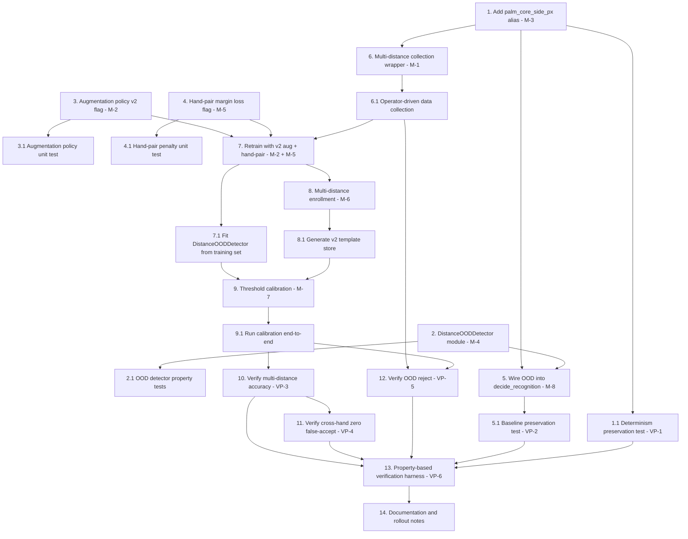

# Implementation Plan — Live Scan Robustness Fix

## Overview

This task list operationalizes the mitigations (M-1 — M-8) and verification
plan (VP-1 — VP-6) from `design.md`, following the reversible rollout
sequence. Each task references the bugfix requirement clauses it
satisfies (e.g., `Requirements: 2.1, 3.4`) and, where applicable, the
correctness Property it validates (e.g., `Property: 4 (Preservation)`).

Numbering convention:
- Top-level tasks (1, 2, ...) align with the rollout phases in
  `design.md` "Migration & rollout".
- Sub-tasks (1.1, 1.2, ...) describe concrete code changes, configuration
  toggles, or verification artifacts.

Coding constraints (do not violate during any task):
- NAS architecture (genotype) MUST remain unchanged.
- Capture settings (`exposure-us 8000`, `gain 1.1`, `awbgains 1.0,1.0`,
  `brightness -0.04`, `contrast 1.3`, `saturation 0`, NIR 850 nm + 1
  tisu) MUST remain unchanged.
- Profile preprocessing `dataset_v3` MUST produce byte-equal output
  for the same input (validated by VP-1).
- ONNX I/O contract (`logits`, `embedding`, input `[1, 3, 224, 224]`)
  MUST remain unchanged.
- Every new behavior MUST be opt-in (CLI flag or config key) so the
  legacy path remains the default.

## Tasks

- [ ] 1. Add zero-risk distance proxy alias (M-3)
  - Modify `palm_preprocessing.py:preprocess_palm_image()` to add
    `debug["palm_core_side_px"] = int(debug["roi_side"])` only when
    `adaptive_roi=True`. Do not modify any algorithm. When `adaptive_roi`
    is False, set `debug["palm_core_side_px"] = None`.
  - Update the metadata writers in `capture_on_hand_detect.py`
    (`build_preprocessing_metadata`) and
    `prototype_nas_recognition_onnx.py` (`save_recognition_event`) to
    propagate `palm_core_side_px` into the JSON sidecar without
    modifying any other field.
  - Requirements: 3.4
  - Property: 4 (Preservation)

- [ ] 1.1 Determinism preservation test (VP-1)
  - Add `tests/test_preprocessing_determinism.py` that pre-computes
    SHA-256 hashes of `final.png`, `roi.png`, `clahe.png`, `mask.png`,
    `vessel_preview.png` from `dataset/835/*.bmp` and
    `dataset/836/*.bmp` before the M-3 change, then re-runs
    `preprocess_palm_image(profile="dataset_v3")` after the change and
    asserts byte-equality on all 20 images.
  - Use `pytest` (consistent with existing `tests/` layout). Test must
    fail loudly if any pixel differs.
  - Requirements: 3.4
  - Property: 4 (Preservation)

- [ ] 2. Implement `DistanceOODDetector` standalone module (M-4)
  - Create `ood_detector.py` exposing `DistanceOODStats` dataclass and
    `DistanceOODDetector` class as described in `design.md` § M-4.
  - Implement `fit()` that computes mean, std, P5, P95, n_samples from
    a list of palm-core ROI sides in pixels.
  - Implement `is_in_distribution(query_side_px) -> tuple[bool, dict]`
    using both gates: `|q - mean| <= sigma_threshold * std` AND
    `q ∈ [p05 - margin_px, p95 + margin_px]`. Return diagnostics dict
    `{"z_score": ..., "percentile_position": ..., "decision_basis": ...}`.
  - Implement `serialize()` / `deserialize()` round-trip via JSON.
  - Default constants: `sigma_threshold=3.0`, `pct_lower=5.0`,
    `pct_upper=95.0`, `margin_px=round(0.10 * mean_px)`.
  - Requirements: 1.4, 2.4, 2.6
  - Property: 2 (OOD reject)

- [ ] 2.1 Property-based unit test for `DistanceOODDetector`
  - Add `tests/test_ood_detector.py` using `hypothesis`:
    - Generate `palm_core_side_px_list` via
      `lists(integers(min_value=50, max_value=500), min_size=10, max_size=200)`
      and a `query_side_px` from the same domain.
    - Property A: After `fit(samples)`, `is_in_distribution(s)` for any
      `s ∈ samples` returns `True` whenever `mean - sigma*std <= s <= mean + sigma*std`
      AND `p05 - margin <= s <= p95 + margin`.
    - Property B: Serialize-then-deserialize round-trip preserves
      `is_in_distribution()` decisions for all sampled queries
      (functional equivalence after JSON cycle).
    - Property C: Monotone decision boundary — if `is_in_distribution(q)`
      is True, then for `q' = mean + sign(q - mean) * |q - mean| / 2`
      it is also True (closer to mean ⇒ still in-distribution).
  - Requirements: 2.4, 2.6
  - Property: 2 (OOD reject)

- [ ] 3. Add augmentation policy v2 flag (M-2)
  - Modify `palm_vein_dataset.py:get_transforms()` to accept
    `augmentation_policy: str = "v1_legacy"`.
  - When `augmentation_policy == "v1_legacy"`: behavior identical to
    current code (no change visible to legacy callers).
  - When `augmentation_policy == "v2_multi_distance"` and
    `split == "train"` and `use_augmentation` is True:
    - Remove `RandomHorizontalFlip(p=0.5)`.
    - `RandomRotation(degrees=15)`.
    - `RandomAffine(degrees=0, translate=(0.08, 0.08), scale=(0.78, 1.28))`.
    - `ColorJitter(brightness=0.20, contrast=0.15)`.
    - Keep `Cutout(cutout_length)` as final step.
  - Validate `augmentation_policy` (raise `ValueError` for any other
    string).
  - Plumb the flag through `create_retrain_dataloaders()` reading
    `RETRAIN_CFG.get("augmentation_policy", "v1_legacy")` from
    `nas_config.py`.
  - Requirements: 1.1, 1.2, 1.3, 2.1, 2.2, 2.3, 3.4 (legacy default)
  - Property: 1 (Accept correct subject), 3 (Cross-hand invariant)

- [ ] 3.1 Augmentation policy unit test
  - Add `tests/test_augmentation_policy.py`:
    - Property A (legacy preservation): when
      `augmentation_policy="v1_legacy"`, the returned `Compose.transforms`
      list matches the pre-change list element-by-element (use class
      names + parameters).
    - Property B (no flip in v2): when
      `augmentation_policy="v2_multi_distance"` and `split="train"`, no
      transform is `RandomHorizontalFlip`.
    - Property C (eval untouched): for `split in {"val","test"}`, both
      policies return the same transform list.
  - Requirements: 3.4, 3.5
  - Property: 4 (Preservation)

- [ ] 4. Add hand-pair margin loss flag (M-5)
  - Add `hand_pair_penalty(logits, labels, pair_class_indices, margin,
    weight)` helper to `retrain.py` (or a new `losses.py` module
    imported by `retrain.py`).
  - In `train_one_epoch()`, after computing CE loss, if
    `RETRAIN_CFG.get("hand_pair_margin_loss", False)` is True:
    - Resolve `pair_class_indices` from `RETRAIN_CFG["hand_pair_classes"]`
      (e.g. `[("835","836")]`) using `data_info["label_map"]`.
    - Compute `loss = ce_loss + hand_pair_penalty(...)` with margin
      defaulting to `1.0` and weight defaulting to `0.3`.
  - Default flag is `False` so legacy retrains produce identical loss
    as before.
  - Add config keys to `nas_config.py`:
    `RETRAIN_CFG["hand_pair_margin_loss"] = False`,
    `RETRAIN_CFG["hand_pair_classes"] = []`,
    `RETRAIN_CFG["hand_pair_margin"] = 1.0`,
    `RETRAIN_CFG["hand_pair_weight"] = 0.3`.
  - Requirements: 2.2, 2.3
  - Property: 3 (Cross-hand invariant)

- [ ] 4.1 Hand-pair penalty unit test
  - Add `tests/test_hand_pair_penalty.py`:
    - Property A (zero when wide margin): if logits already satisfy
      `logit_target - logit_pair >= margin` for every paired sample,
      `hand_pair_penalty(...)` returns 0.0.
    - Property B (scales with violation): if `logit_target = logit_pair`,
      penalty equals `weight * margin * num_paired_samples / batch_size`
      (or matching reduction strategy).
    - Property C (no effect when flag empty): with
      `pair_class_indices=[]`, penalty is exactly 0.0 regardless of
      logits.
  - Requirements: 2.2, 2.3
  - Property: 3 (Cross-hand invariant)

- [ ] 5. Wire OOD detector into decision rule (M-8)
  - Modify `prototype_nas_recognition_onnx.py:decide_recognition()` to
    accept an optional `ood_detector: DistanceOODDetector | None =
    None` argument.
  - When `ood_detector is not None`, read `palm_core_side_px` from
    `preprocessing_result["debug"]`. If it is `None` (legacy
    non-adaptive ROI), skip the OOD check and emit no extra reason.
    Otherwise call `is_in_distribution()`; on `False`, append
    `"out_of_distribution_distance"` to `reasons`.
  - Add CLI flag `--ood-detector-path` to load an OOD detector from
    JSON; when omitted, no OOD check runs (preservation klausul 3.6).
  - Update `save_recognition_event()` to include OOD diagnostics in
    metadata when the detector ran.
  - Requirements: 1.4, 2.4, 2.6, 3.6
  - Property: 2 (OOD reject), 4 (Preservation when detector absent)

- [ ] 5.1 Baseline preservation test (VP-2)
  - Add `tests/test_baseline_preservation.py`:
    - Load
      `nas_results/retrain_run6_plus2_e100/best_model.pth` and the
      existing `split_info.json`. Run `evaluate_test()` from
      `retrain.py` after the M-3 + M-8 changes (no OOD detector
      passed). Compare top-1 accuracy with the value stored in
      `nas_results/retrain_run6_plus2_e100/test_results.json`.
    - Acceptance: `accuracy_after >= accuracy_before - 0.01` (TA-1).
  - Requirements: 3.5, 3.6, 3.7
  - Property: 4 (Preservation)

- [ ] 6. Implement multi-distance dataset collection wrapper (M-1)
  - Create `collect_multi_distance_dataset.py` that wraps
    `capture_on_hand_detect.py` without changing camera parameters.
  - Expose `collect_multi_distance_session(output_root, subject_id,
    distances_cm, samples_per_distance, capture_args)` that:
    - For each distance prompt the operator (text prompt to console)
      to position the hand at that distance, then invokes the capture
      pipeline (re-using `configure_camera`, `build_background`,
      `detect_hand`, `capture_burst_best_frame`) until
      `samples_per_distance` accepted captures are saved into
      `output_root / subject_id / f"{int(distance)}cm"`.
    - Reuses `dataset/{subject_id}/*.bmp` as the 27 cm bucket via a
      copy or symlink step (do not re-capture 27 cm).
  - Default `distances_cm = [22.0, 25.0, 27.0, 29.0, 32.0]` and
    `samples_per_distance = 10` to hit the 100-image collection target.
  - Document the operator workflow at the top of the file.
  - Requirements: 2.1, 2.5, 3.3, 3.8
  - Property: 1 (Accept correct subject)

- [ ] 6.1 Operator-driven data collection
  - Run `collect_multi_distance_dataset.py` for `subject_id=835` and
    `subject_id=836` to populate `dataset_multi_distance/`.
  - Build a held-out test split by reserving 5 samples per
    `(subject, distance)` (50 images total) under
    `dataset_multi_distance_test/`. Train/val portion (50 images)
    remains under `dataset_multi_distance/`.
  - Save a manifest `dataset_multi_distance/manifest.json` listing
    paths grouped by `(subject_id, distance_cm, split)`.
  - Requirements: 2.5
  - Property: 1 (Accept correct subject)

- [ ] 7. Retrain NAS-DARTS with v2 augmentation + hand-pair loss
  - Create `retrain_run7_robust.py` (analogous to
    `retrain_run6_plus2.py`) that:
    - Builds an extended split file from `dataset_multi_distance/`
      using the same logic as `build_split_from_subjects()` but
      flattening per-distance subfolders into a unified per-subject
      training pool.
    - Sets `RETRAIN_CFG["augmentation_policy"] = "v2_multi_distance"`
      and `RETRAIN_CFG["hand_pair_margin_loss"] = True` for the run.
    - Reuses the existing genotype at
      `nas_results/search/genotype_final.json` (NAS architecture
      preserved per klausul 3.5).
    - Outputs to `nas_results/retrain_run7_robust/`.
  - Run training and capture `best_model.pth`, `last_model.pth`,
    `test_results.json`, `training_log.csv`.
  - Re-export ONNX via `export_retrain_run6_plus2_onnx.py` (or a
    parallel `export_retrain_run7_robust_onnx.py`) using the same
    schema so `logits` and `embedding` outputs remain.
  - Requirements: 1.1, 1.2, 1.3, 2.1, 2.2, 2.3, 3.5
  - Property: 1 (Accept correct subject), 3 (Cross-hand invariant)

- [ ] 7.1 Fit `DistanceOODDetector` from training set
  - After step 7 completes, iterate over the training+validation
    splits and collect `palm_core_side_px` via
    `preprocess_palm_image()` for each image.
  - Fit `DistanceOODDetector` on the collected list and serialize to
    `nas_results/retrain_run7_robust/distance_ood_stats.json`.
  - Requirements: 2.4, 2.6
  - Property: 2 (OOD reject)

- [ ] 8. Multi-distance enrollment (M-6)
  - Modify `enroll_templates_onnx.py` to introduce
    `enroll_subject_multi_distance(bundle, subject_id, folder,
    min_images)`:
    - Detect whether `folder` contains per-distance subfolders
      (`22cm/`, `25cm/`, ...). If so, compute one mean L2-normalized
      embedding per distance bucket (`per_distance_templates`) plus
      a global mean (`global_template`).
    - If `folder` is flat, fall back to the legacy single-template
      path but write the result under `global_template` AND alias it
      to `template` for backward compatibility.
    - Always collect `palm_core_side_px_samples` for the OOD
      detector.
    - Set `schema_version=2` and keep `metric="cosine_similarity"`.
  - Update `prototype_nas_recognition_onnx.py:predict_verification_sample()`
    to read either schema v1 (`templates[id]["template"]`) or v2
    (`templates[id]["global_template"]` with optional
    `per_distance_templates`). Cosine score uses `global_template`
    by default; if `per_distance_templates` is non-empty, also
    compute per-distance scores and take `max` to support better
    multi-distance positives.
  - Requirements: 2.1, 3.7
  - Property: 1 (Accept correct subject), 4 (Preservation v1 reader)

- [ ] 8.1 Generate v2 template store from multi-distance enrollment
  - Run the modified `enroll_templates_onnx.py` against
    `dataset_multi_distance/` to produce
    `nas_results/retrain_run7_robust/template_store.json` with
    schema v2.
  - Verify the `template` alias is present and equal to
    `global_template` for both subjects.
  - Requirements: 2.1, 3.7
  - Property: 4 (Preservation)

- [ ] 9. Threshold calibration (M-7)
  - Create `calibrate_thresholds.py` exposing
    `calibrate_thresholds(onnx_path, template_store_path,
    positive_set, negative_set, output_path, target_tar=0.95,
    ood_detector_path=None)`.
  - Sweep grid `(similarity_threshold ∈ [0.80, 0.95, step 0.01],
    similarity_gap ∈ [0.02, 0.15, step 0.01])` and select the
    operating point that:
    - Has zero false-accept on cross-hand pairs from
      `positive_set` (TA-3).
    - Has TAR ≥ `target_tar` on the multi-distance positives in
      `D_validated` (TA-2).
    - Does not increase false-accept beyond baseline on captures in
      `D_op` (preservation klausul 3.6).
  - Persist the chosen point and validation summary to
    `thresholds.json` per the schema in `design.md` § M-7.
  - Update `prototype_nas_recognition_onnx.py` to accept
    `--thresholds path/to/thresholds.json` and override the relevant
    argparse defaults at startup.
  - Requirements: 2.1, 2.2, 2.3, 3.6
  - Property: 1 (Accept correct subject), 3 (Cross-hand invariant),
    4 (Preservation in D_op)

- [ ] 9.1 Run calibration end-to-end
  - Build `negative_set/` containing OOD captures (target step 10
    will populate this further). For initial calibration, use
    `dataset_multi_distance/` cross-hand pairs as the only negatives.
  - Run `calibrate_thresholds.py` to produce
    `nas_results/retrain_run7_robust/thresholds.json`.
  - Document the chosen operating point in the run log.
  - Requirements: 2.1, 2.2, 2.3, 3.6
  - Property: 1, 3, 4

- [ ] 10. Verification: multi-distance accuracy (VP-3)
  - Add `tests/test_vp3_multi_distance_accuracy.py` (or a CLI script
    `verify_vp3.py`) that:
    - Loads the OOD detector from
      `nas_results/retrain_run7_robust/distance_ood_stats.json` and
      the calibrated thresholds.
    - Runs the full pipeline on every image in
      `dataset_multi_distance_test/`.
    - Asserts top-1 accuracy ≥ 95% (TA-2) on
      `X.distance ∈ D_validated`.
  - Requirements: 2.1, 2.2, 2.3
  - Property: 1 (Accept correct subject)

- [ ] 11. Verification: cross-hand zero false-accept (VP-4)
  - Extend the VP-3 test (or add `verify_vp4.py`) to extract the
    subset where ground truth is `835` and assert no result is
    `accepted` with `predicted_subject = "836"`, and vice versa
    (TA-3).
  - Requirements: 2.2, 2.3
  - Property: 3 (Cross-hand invariant)

- [ ] 12. Verification: OOD reject at 18 cm and 38 cm (VP-5)
  - Collect 20 captures per hand at 18 cm and 38 cm using
    `collect_multi_distance_session(distances_cm=[18.0, 38.0],
    samples_per_distance=20)` into `dataset_multi_distance_ood/`.
  - Add `verify_vp5.py` that runs the full pipeline (with OOD
    detector enabled) over this set and asserts:
    - ≥ 90% are rejected.
    - Of the rejected results, ≥ 90% include
      `"out_of_distribution_distance"` in `reasons` (TA-4).
  - Requirements: 2.4, 2.6
  - Property: 2 (OOD reject)

- [ ] 13. Property-based verification harness (VP-6)
  - Create `verify_bug_property.py` that consumes a directory of
    labeled events (each event has `image_path`, `distance_cm`,
    `subject`, `side`, `in_quality_band`) plus the model artifact +
    OOD detector + thresholds + template store.
  - Implement `is_bug_condition(X, D_op=(26,28), D_validated=(22,32))`
    matching the specification in `design.md` Correctness Properties.
  - Implement `assert_fix_checking(events)` that asserts Properties
    1, 2, and 3 from `design.md`.
  - Implement `assert_preservation_checking(events)` that asserts
    Property 4 by also running the **baseline** pipeline (without M-2,
    M-5, M-7 active; OOD detector disabled) on each event and
    comparing `(decision, predicted_subject, sorted(reasons))`
    tuples. The baseline pipeline is invoked via the legacy
    `nas_results/retrain_run6_plus2_e100/` artifacts.
  - The harness reads events from a YAML/JSON manifest combining
    VP-3, VP-4, VP-5 datasets so a single invocation validates all
    properties.
  - Run the harness as the final acceptance gate; any failed
    assertion blocks rollout.
  - Requirements: 1.1, 1.2, 1.3, 1.4, 1.5, 2.1, 2.2, 2.3, 2.4, 2.5,
    2.6, 3.1, 3.2, 3.4, 3.5, 3.6, 3.7
  - Property: 1, 2, 3, 4

- [ ] 14. Documentation and rollout notes
  - Update `palm_capture_tuning_protocol.md` with a new section
    "Multi-distance robustness rollout" summarizing the new flags
    (`augmentation_policy="v2_multi_distance"`,
    `hand_pair_margin_loss=True`, `--ood-detector-path`,
    `--thresholds`) and the verification artifacts produced under
    `nas_results/retrain_run7_robust/`.
  - Document how to revert to the legacy pipeline by omitting the new
    flags (preservation klausul 3.x).
  - Requirements: 2.5, 3.6
  - Property: 4 (Preservation when reverted)


## Task Dependency Graph



Parallelization opportunities (independent branches):
- Tasks **1**, **2**, **3**, **4** can run in parallel (all are
  isolated module-level edits with their own unit tests).
- Once tasks 1 and 2 land, tasks 5 and 6 can proceed in parallel.
- Tasks 10 and 11 share the same VP-3/VP-4 dataset and can be
  implemented in a single pass against the same evaluation script.
- Task 12 (VP-5) depends only on data collection (6.1) and threshold
  calibration (9.1); it does not block tasks 10/11.

### Wave Definitions

```json
{
  "waves": [
    {
      "wave": 1,
      "tasks": ["1", "1.1", "2", "2.1", "3", "3.1", "4", "4.1"],
      "rationale": "Independent module-level edits with isolated unit tests; safe to run in parallel."
    },
    {
      "wave": 2,
      "tasks": ["5", "5.1", "6", "6.1"],
      "rationale": "Wiring OOD into decision rule depends on tasks 1 and 2; collection wrapper depends on the alias from task 1."
    },
    {
      "wave": 3,
      "tasks": ["7", "7.1"],
      "rationale": "Retraining requires augmentation policy v2 (task 3), hand-pair loss (task 4), and the multi-distance dataset (task 6.1)."
    },
    {
      "wave": 4,
      "tasks": ["8", "8.1", "9", "9.1"],
      "rationale": "Multi-distance enrollment and threshold calibration consume the retrain artifacts and OOD stats from wave 3."
    },
    {
      "wave": 5,
      "tasks": ["10", "11", "12"],
      "rationale": "Verification VP-3, VP-4, VP-5 depend on calibrated thresholds and template store from wave 4. VP-3 and VP-4 share data; VP-5 needs additional OOD captures already gated on tasks 6.1 and 9.1."
    },
    {
      "wave": 6,
      "tasks": ["13", "14"],
      "rationale": "Property-based harness aggregates all prior verifications; documentation closes the rollout."
    }
  ]
}
```

## Notes

- **Reversibility:** Every task either (a) is purely additive (M-3
  alias, M-4 standalone module, M-1 wrapper, M-7 calibration script)
  or (b) is gated behind a default-off flag (`augmentation_policy`,
  `hand_pair_margin_loss`, `--ood-detector-path`, `--thresholds`).
  This guarantees that omitting the new flags reproduces the legacy
  pipeline exactly, satisfying preservation properties at every step
  of the rollout.
- **Property mapping summary:**
  - Property 1 (Accept correct subject in `D_validated`) — covered
    primarily by tasks 7, 8, 9, 10.
  - Property 2 (OOD reject with explicit reason) — covered by tasks
    2, 5, 7.1, 9.1, 12.
  - Property 3 (Cross-hand invariant) — covered by tasks 3, 4, 7, 9,
    11.
  - Property 4 (Preservation on non-buggy inputs) — covered by tasks
    1, 1.1, 3.1, 5.1, 8 (alias), 13 (harness final gate).
- **Hardware dependency:** Tasks 6.1 and 12 require physical access
  to the Raspberry Pi 5 + Pi NoIR v2 + 850 nm NIR + 1 tisu capture
  rig. Capture settings (NIR + tisu + exposure 8000 µs) MUST not be
  altered during collection (klausul 3.3).
- **Compute dependency:** Task 7 (retraining) is the longest item in
  the plan; budget similarly to the existing
  `nas_results/retrain_run6_plus2_e100/` run. Subsequent tasks depend
  on its artifacts.
- **Final acceptance gate:** Task 13 (`verify_bug_property.py`)
  combines VP-3, VP-4, VP-5, and VP-6 into a single property-based
  check. The fix is considered complete only when this harness passes
  along with VP-1 (task 1.1) and VP-2 (task 5.1).
